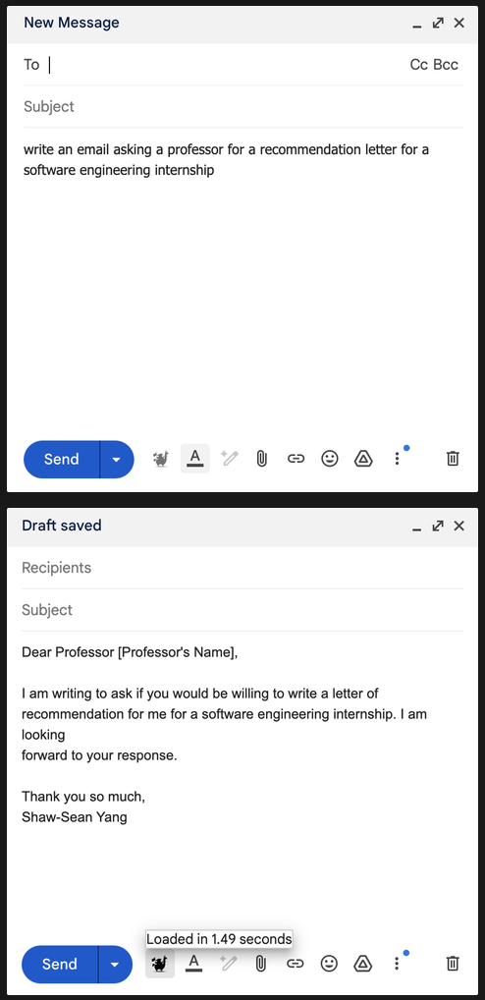

# Panza Chrome Extension

## About
A chrome extension for the [Panza](https://github.com/IST-DASLab/PanzaMail) project.

## Features
- Adds a button to the Gmail compose view that allows users to query a local Panza server with the current email body as a query and replaces the email body with the Panza response.

## Requirements
- A Panza web server (see [Panza](https://github.com/IST-DASLab/PanzaMail) `./run_services.sh`) must be running on localhost:5000 (or ssh-tunneled to port 5000).

## Instructions

1. Run `npm install` to install dependencies.
2. Run `npm start` to start the development server.
3. In Chrome, go to chrome://extensions, turn on Developer mode, click "Load unpacked", and pick the "dist" directory within this project.
4. Make sure the Panza web server is running (see Requirements above).
5. Open https://mail.google.com/ and click "Compose an email" at the top left.
6. There's a button added to the Compose view!